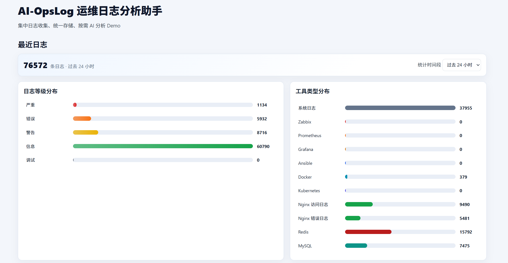
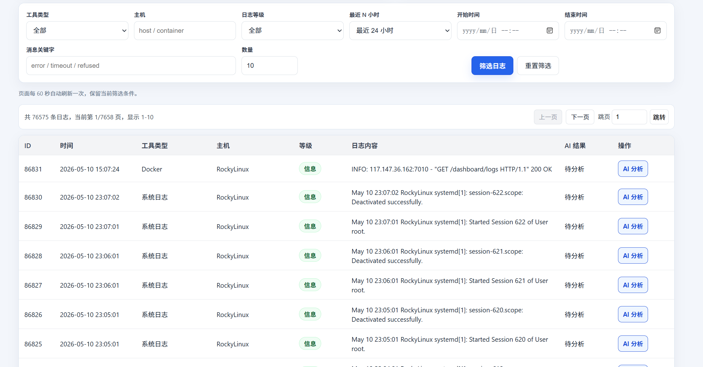
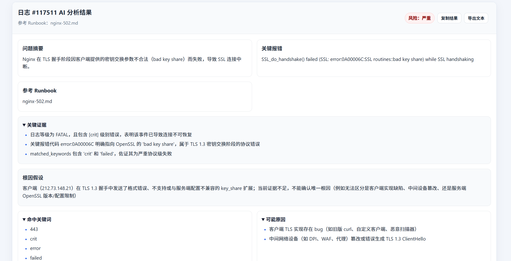

# AI-OpsLog

AI-OpsLog 是一个基于OpenAI codex开发的面向运维场景的 AI 日志分析 Demo 项目。项目支持多来源日志采集、SQLite 统一存储、Web 页面集中展示与筛选、历史统计可视化，以及单条日志按需调用通义千问进行原因分析和排查建议生成。

当前项目用于个人学习、演示和使用，不是生产级 AIOps 平台。

## 项目逻辑

AI-OpsLog 的最终主链路是：

```text
服务日志文件 -> 采集脚本 -> 字段标准化 -> SQLite logs 表 -> Web 看板筛选/统计 -> 单条日志按需 AI 分析
```

关键设计：

- Web 服务负责展示、筛选、统计和按需 AI 分析。
- 日志采集由 `scripts/collect_unified_logs.py` 独立完成，可通过 cron 或 systemd 运行。
- `once` 模式使用 offset state 记录读取位置，避免重复采集同一批日志。
- SQLite 默认只保留最近 7 天日志，过期数据归档到 `data/archives/*.jsonl`。
- AI 分析只在用户点击按钮时触发，不自动分析全部日志，也不执行系统命令。
- 当前最终版本不生成 Markdown 报告，早期历史接口仅作为兼容能力保留。

## 功能概览

- 统一日志采集：支持定时读取和 tail 实时跟随。
- 多服务日志：系统日志、Zabbix、Prometheus、Grafana、Ansible、Docker、Kubernetes、Nginx、Redis、MySQL。
- 日志等级：`FATAL`、`ERROR`、`WARN`、`INFO`、`DEBUG`。
- 标准字段：`timestamp`、`source`、`host`、`log_level`、`message`、`AI_analysis_result`、`created_at`。
- 数据存储：SQLite，默认路径 `data/ai_opslog.db`。
- 数据保留：默认保留最近 7 天，超出记录归档到 `data/archives/*.jsonl`。
- Web 看板：`GET /dashboard/logs` 展示最近日志、筛选、搜索、分页和统计。
- Web 可读性优化：默认展示最近 24 小时的 10 条日志，消息列自动省略，关键字高亮，高风险日志醒目标记。
- 历史统计：按日志等级和工具类型展示过去 24 小时或 7 天分布。
- 指标关联：可选接入 Prometheus，只读展示关键指标快照。
- 现场采集：可选只读展示 Docker 容器和 Kubernetes Pod / Event 快照。
- 按需 AI 分析：点击单条日志的 `AI 分析` 按钮，展示问题原因和排查建议。
- Runbook 参考：按需 AI 分析会按日志来源和关键词匹配 `docs/runbooks/` 中的故障手册。
- 历史接口保留：`/history/recent`、`/history/{id}`。

## 页面预览

1. WEB界面数据总览



2. 日志信息收集列表



3. AI分析结果



## 技术栈

- Python
- FastAPI
- SQLite
- Docker / Docker Compose
- 阿里云百炼 / 通义千问 Qwen
- Python 标准库 `sqlite3`

## 快速开始

复制环境变量示例：

```bash
cp .env.example .env
```

编辑 `.env`：

```env
DASHSCOPE_API_KEY=your_dashscope_api_key_here
DASHSCOPE_BASE_URL=https://dashscope.aliyuncs.com/compatible-mode/v1
QWEN_MODEL=qwen-plus
AI_OPSLOG_DB_PATH=data/ai_opslog.db
```

启动服务：

```bash
docker compose up -d --build
```

健康检查：

```bash
curl http://127.0.0.1:8000/health
```

访问 Web 看板：

```text
http://127.0.0.1:8000/dashboard/logs
```

注意：启动 Web 服务不会自动采集日志。需要运行采集脚本，或配置 cron / systemd 自动采集。
`once` 模式默认记录文件 offset，适合 cron 每分钟采集新增日志，避免重复写入同一批日志。

## 日志采集

手动采集一次：

```bash
python scripts/collect_unified_logs.py \
  --mode once \
  --lines 100 \
  --target source=system,path=/var/log/messages,host=RockyLinux
```

实时跟随日志：

```bash
python scripts/collect_unified_logs.py \
  --mode tail \
  --interval 1 \
  --target source=system,path=/var/log/messages,host=RockyLinux
```

多来源采集：

```bash
python scripts/collect_unified_logs.py \
  --mode once \
  --target source=system,path=/var/log/messages,host=RockyLinux \
  --target source=nginx_error,path=/var/log/nginx/error.log,host=RockyLinux \
  --target source=redis,path=/var/log/redis/redis-server.log,host=RockyLinux
```

自动采集配置见 [docs/auto-collection.md](docs/auto-collection.md)。

## Web 展示与筛选

`GET /dashboard/logs` 默认展示最近 24 小时的 10 条日志，支持：

- 工具类型：`source`
- 主机：`host`
- 日志等级：`log_level`
- 最近 N 小时：`recent_hours`
- 时间范围：`time_from`、`time_to`
- 消息关键字：`keyword`
- 返回数量：`limit`
- 页码：`page`

示例：

```bash
curl "http://127.0.0.1:8000/dashboard/logs?source=docker&log_level=ERROR&keyword=timeout&limit=50&page=1"
```

多个筛选条件之间使用 AND 关系。关键字搜索会在 `message` 字段中做基础包含匹配。

页面展示层已做优化：
- 时间统一显示为 `YYYY-MM-DD HH:MM:SS`
- 日志等级、工具类型、AI 状态使用中文展示
- 日志消息列超过 3 行自动折叠，鼠标悬停可查看完整内容，点击消息可展开/收起
- 搜索关键字在日志消息中高亮显示
- `FATAL` / `ERROR` 行红色高亮，`WARN` 行橙色高亮
- 统计图表显示数量，鼠标悬停显示占比，点击图表项可快速筛选
- AI 分析结果使用卡片布局展示，风险等级用色块突出，排查建议支持折叠/展开
- AI 分析结果支持在浏览器中复制为文本或导出为 `.txt` 文件，不写入服务器报告目录
- 页面每 60 秒自动刷新一次，并保留当前筛选条件

性能相关优化：
- SQLite 使用 WAL、busy timeout 和常用查询索引，提升采集写入与 Web 查询并发稳定性
- 采集脚本使用队列和批量写入，`once` 模式用 offset state 只采集新增日志
- 归档任务后台执行，避免阻塞高频采集主流程
- Web 侧保留服务端分页，避免一次渲染过多日志
- AI 分析请求按需触发，按钮会在请求期间禁用，避免重复点击造成并发堆积

## 历史统计

Web 页面顶部提供统计模块：

- 日志等级分布：`FATAL`、`ERROR`、`WARN`、`INFO`、`DEBUG`
- 工具类型分布：系统日志、Zabbix、Prometheus、Grafana、Ansible、Docker、Kubernetes、Nginx、Redis、MySQL
- 统计范围：过去 24 小时、过去 7 天

统计图使用纯 HTML/CSS 绘制，不引入前端框架。

## 按需 AI 分析

Web 页面每条日志都有 `AI 分析` 按钮。点击后调用：

```text
POST /logs/{id}/analyze
```

分析结果在页面详情区显示：

- 问题摘要
- 关键报错
- 参考 Runbook
- 关键证据
- 命中关键词
- 根因假设
- 风险等级
- 可能原因
- 排查建议
- 验证方法
- 操作风险提示
- 后续预防建议
- 补充说明

AI 分析只按需触发，不会自动执行系统命令，不会生成 Markdown 报告。
页面支持将当前 AI 分析结果复制到剪贴板，或导出为本地 `.txt` 文件。导出动作只发生在浏览器侧，不会在服务端生成报告文件。

当前内置 Runbook 位于 [docs/runbooks](docs/runbooks)：

- `nginx-502.md`
- `redis-connection-error.md`
- `mysql-connection-error.md`
- `disk-space-low.md`
- `system-service-error.md`

## Prometheus 指标关联

Prometheus 是可选能力。配置后，Web 看板会展示只读指标快照，并提供 JSON 接口：

```text
GET /metrics/prometheus
```

环境变量：

```env
PROMETHEUS_BASE_URL=http://127.0.0.1:9090
PROMETHEUS_TIMEOUT_SECONDS=3
```

当前默认查询：

- `sum(up)`：存活目标数量
- `sum(rate(http_requests_total{status=~"5.."}[5m]))`：HTTP 5xx 速率
- `sum(rate(process_cpu_seconds_total[5m]))`：进程 CPU 速率
- `sum(process_resident_memory_bytes)`：进程内存

该功能只读查询 Prometheus，不会修改监控配置，也不会触发自动处置。

## Docker / Kubernetes 只读现场采集

Docker / Kubernetes 现场采集是可选能力。配置后，Web 看板会展示当前运行现场的只读快照，并提供 JSON 接口：

```text
GET /runtime/snapshot
```

环境变量：

```env
AI_OPSLOG_ENABLE_DOCKER_SNAPSHOT=true
AI_OPSLOG_ENABLE_KUBERNETES_SNAPSHOT=true
RUNTIME_SNAPSHOT_TIMEOUT_SECONDS=3
RUNTIME_SNAPSHOT_MAX_ITEMS=8
DOCKER_BIN=docker
KUBECTL_BIN=kubectl
```

当前只执行固定只读命令：

- `docker ps --format ...`
- `kubectl get pods -A --no-headers`
- `kubectl get events -A --sort-by=.lastTimestamp --no-headers`

该功能不会执行 `delete`、`restart`、`scale`、`apply` 等修改现场状态的命令。Docker 或 kubectl 不可用时，页面会显示简短错误信息，不影响日志查询和 AI 分析。

## 保留接口

- `GET /health`
- `GET /dashboard/logs`
- `GET /metrics/prometheus`
- `GET /runtime/snapshot`
- `POST /logs/{id}/analyze`
- `GET /history/recent`
- `GET /history/{id}`
- `POST /logs/ingest`
- `POST /alerts/alertmanager`
- `GET /qwen/test`

## 项目结构

```text
AI-Ops-Portfolio/
├── backend/
│   └── app/
│       ├── main.py
│       ├── collectors/
│       ├── services/
│       ├── storage/
│       └── parsers/
├── scripts/
│   └── collect_unified_logs.py
├── docs/
│   ├── auto-collection.md
│   ├── log_sources.md
│   ├── stage-6-plan.md
│   ├── history-api.md
│   └── assets/screenshots/
├── examples/
├── data/
├── logs/
├── docker-compose.yml
└── README.md
```

## 运行时文件

以下文件属于运行时产物，不应提交到 Git：

- `.env`
- `data/*.db`
- `data/*.sqlite`
- `data/*.sqlite3`
- `data/archives/*.jsonl`
- `logs/*.log`

## 文档

- [自动日志采集说明](docs/auto-collection.md)
- [Docker / Kubernetes 只读现场采集](docs/runtime-snapshot.md)
- [统一日志来源说明](docs/log_sources.md)
- [故障 Runbook](docs/runbooks/README.md)
- [第六阶段计划](docs/stage-6-plan.md)
- [历史记录 API](docs/history-api.md)
- [项目最终总结](docs/project-final-summary.md)

## GitHub 上传前检查

建议上传前执行：

```bash
python -m compileall backend\app scripts\collect_unified_logs.py
git status --short
```

确认不要提交：

- `.env`
- `data/*.db`
- `data/*.sqlite`
- `data/*state*.json`
- `data/archives/*.jsonl`
- `logs/*.log`

## 安全边界

- AI 输出只作为人工排查参考。
- 系统不会自动执行 AI 返回的建议。
- API Key 通过 `.env` 或环境变量注入，不应提交。
- 当前项目用于 Demo / 学习 / 简历展示，不是生产级平台。
