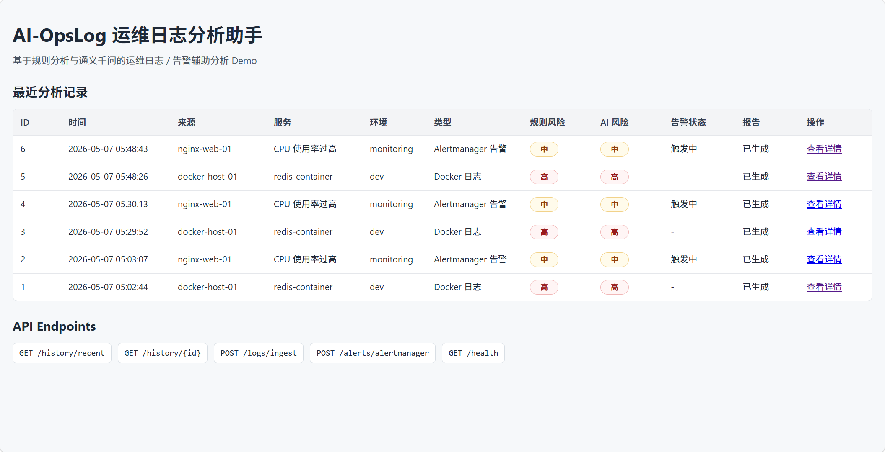
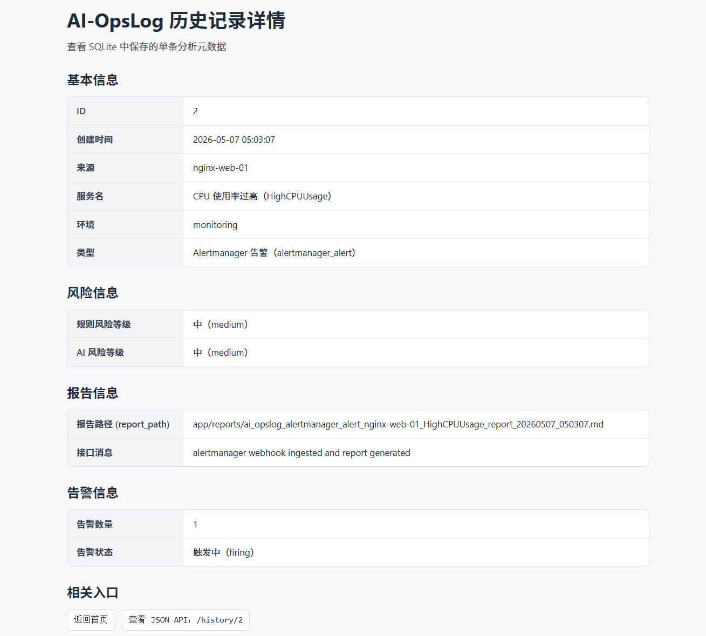

# AI-OpsLog

AI-OpsLog 是一个面向运维 / SRE 场景的 AI 日志分析 Demo 项目。项目支持集中采集多来源日志，统一写入 SQLite，提供 Web 页面筛选最近日志，并支持对单条日志按需调用通义千问进行原因分析和排查建议生成。

当前项目定位为学习和展示项目，不是生产级 AIOps 平台。

## 功能概览

- 统一日志采集：支持定时读取和 tail 实时跟随。
- 多来源日志：系统日志、Zabbix、Prometheus、Grafana、Ansible、Docker、Kubernetes、Nginx、Redis、MySQL。
- 多服务适配：统一适配器负责时间、等级、JSON/logfmt 字段和 Nginx HTTP 状态码解析。
- 标准化字段：`timestamp`、`source`、`host`、`log_level`、`message`、`AI_analysis_result`、`created_at`。
- 日志等级：`FATAL`、`ERROR`、`WARN`、`INFO`、`DEBUG`。
- 数据存储：SQLite，默认路径 `data/ai_opslog.db`。
- 数据保留：默认保留最近 7 天，超出记录归档到 `data/archives/*.jsonl`。
- Web 看板：`GET /dashboard/logs` 展示最近 100 条日志，并支持基础筛选。
- 高级筛选：支持 source、host、log_level、时间范围、消息关键字和分页。
- 按需 AI 分析：点击单条日志的 AI 分析按钮，自动提取关键报错摘要，并在页面展示原因和排查建议。
- 历史接口保留：`/history/recent`、`/history/{id}` 保持兼容。

## 页面预览

集中日志看板：



单条历史记录详情：



## 技术栈

- Python
- FastAPI
- SQLite
- Docker / Docker Compose
- 阿里云百炼 / 通义千问 Qwen
- 标准库 `sqlite3`

## 快速开始

复制环境变量示例：

```bash
cp .env.example .env
```

编辑 `.env`：

```env
DASHSCOPE_API_KEY=your_dashscope_api_key_here
DASHSCOPE_BASE_URL=https://dashscope.aliyuncs.com/compatible-mode/v1
QWEN_MODEL=qwen-plus
REPORTS_DIR=/app/reports
AI_OPSLOG_DB_PATH=data/ai_opslog.db
```

启动服务：

```bash
docker compose up -d --build
```

健康检查：

```bash
curl http://127.0.0.1:8000/health
```

访问 Web 看板：

```text
http://127.0.0.1:8000/dashboard/logs
```

## 日志采集

定时采集示例：

```bash
python scripts/collect_unified_logs.py \
  --mode once \
  --lines 200 \
  --target source=nginx_error,path=/var/log/nginx/error.log,host=nginx-web-01
```

实时跟随示例：

```bash
python scripts/collect_unified_logs.py \
  --mode tail \
  --interval 1 \
  --target source=docker,path=/var/log/docker.log,host=docker-host-01
```

多来源采集示例：

```bash
python scripts/collect_unified_logs.py \
  --mode once \
  --target source=system,path=/var/log/syslog,host=ops-host-01 \
  --target source=redis,path=/var/log/redis/redis-server.log,host=redis-01
```

更多日志来源说明见 [docs/log_sources.md](docs/log_sources.md)。

## Web 展示与筛选

`GET /dashboard/logs` 默认展示最近 100 条日志，支持以下筛选：

- 工具类型：`source`
- 主机：`host`
- 日志等级：`log_level`
- 最近 N 小时：`recent_hours`
- 时间范围：`time_from`、`time_to`
- 消息关键字：`keyword`
- 返回数量：`limit`
- 页码：`page`

示例：

```bash
curl "http://127.0.0.1:8000/dashboard/logs?source=docker&log_level=ERROR&recent_hours=24&limit=100"
```

关键字搜索会在 `message` 字段中做基础包含匹配，多个筛选条件之间使用 AND 关系。分页使用 `page` 和 `limit`，`limit` 当前限制在 1 到 200 之间。

页面展示层会做可读性优化：时间格式化、日志来源中文化、日志等级中文化、长日志内容截断展示。

## 按需 AI 分析

Web 页面每条日志都有 `AI 分析` 按钮。点击后会调用：

```text
POST /logs/{id}/analyze
```

分析结果在页面详情区显示，包括：

- 问题摘要
- 关键报错
- 命中关键词
- 问题原因
- 风险等级
- 可能原因
- 排查建议
- 补充说明

当前按需 AI 分析不会生成 Markdown 报告，不会自动执行系统命令，也不会修改历史接口。

## 保留接口

- `GET /health`
- `GET /dashboard/logs`
- `POST /logs/{id}/analyze`
- `GET /history/recent`
- `GET /history/{id}`
- `POST /logs/ingest`
- `POST /alerts/alertmanager`
- `GET /qwen/test`

## 项目结构

```text
AI-Ops-Portfolio/
├── backend/
│   └── app/
│       ├── main.py
│       ├── services/
│       ├── storage/
│       ├── collectors/
│       └── parsers/
├── scripts/
│   └── collect_unified_logs.py
├── docs/
│   ├── log_sources.md
│   ├── stage-6-plan.md
│   └── assets/screenshots/
├── examples/
├── data/
├── logs/
├── reports/
├── docker-compose.yml
└── README.md
```

## 运行时文件

以下文件属于运行时产物，不应提交到 Git：

- `.env`
- `data/*.db`
- `data/*.sqlite`
- `data/*.sqlite3`
- `data/archives/*.jsonl`
- `logs/*.log`
- `reports/*.md`

## 文档

- [统一日志来源说明](docs/log_sources.md)
- [第六阶段开发计划](docs/stage-6-plan.md)
- [历史记录 API](docs/history-api.md)

## 安全边界

- AI 输出只作为人工排查参考。
- 系统不会自动执行 AI 返回的建议。
- API Key 通过 `.env` 或环境变量注入，不应提交。
- 当前项目用于 Demo / 学习 / 简历展示，不是生产级平台。
